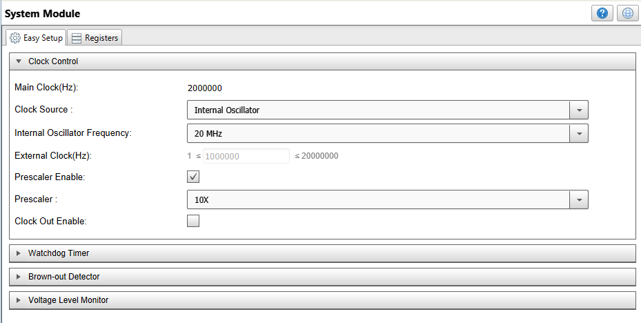
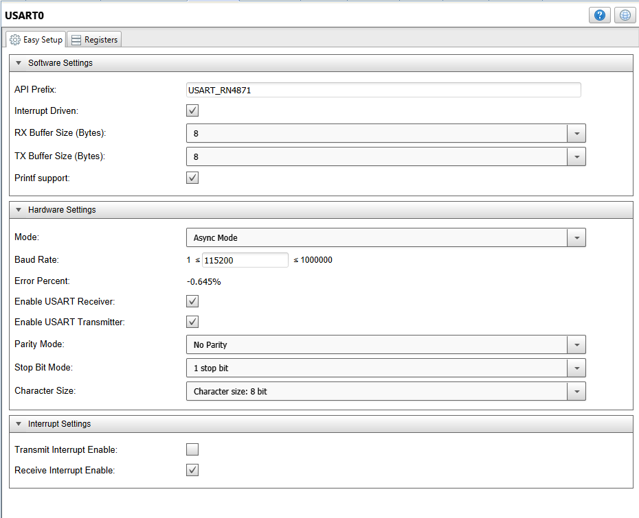
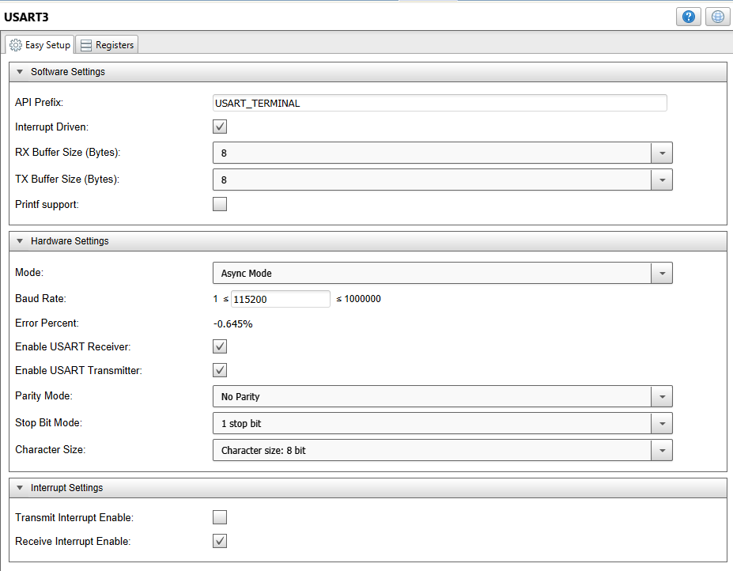
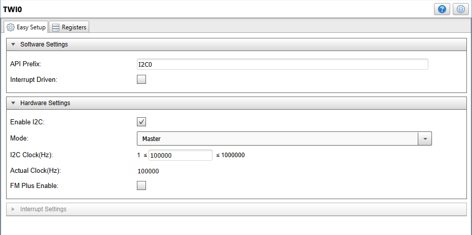
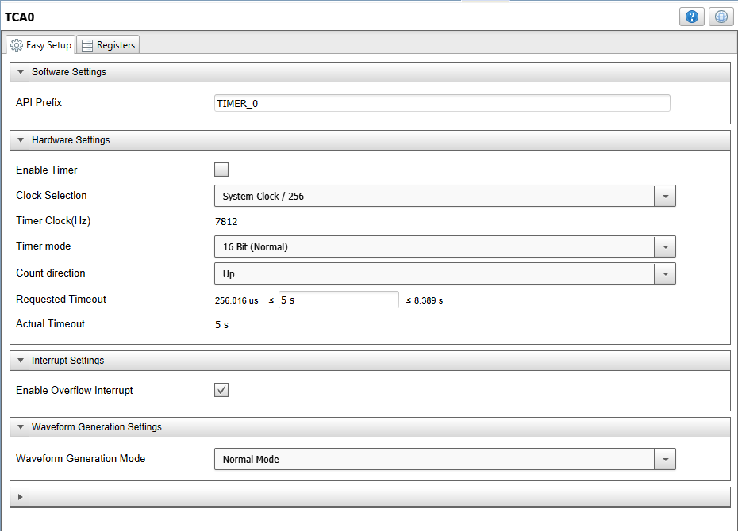
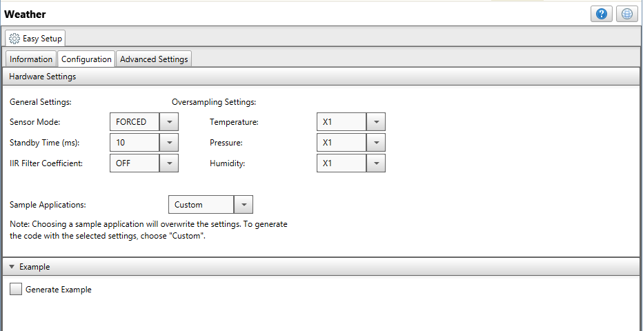
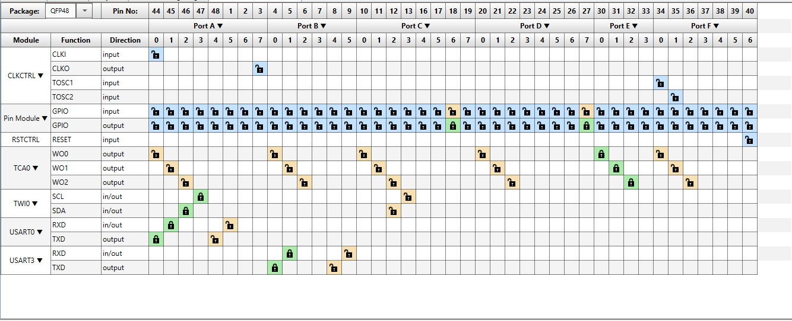
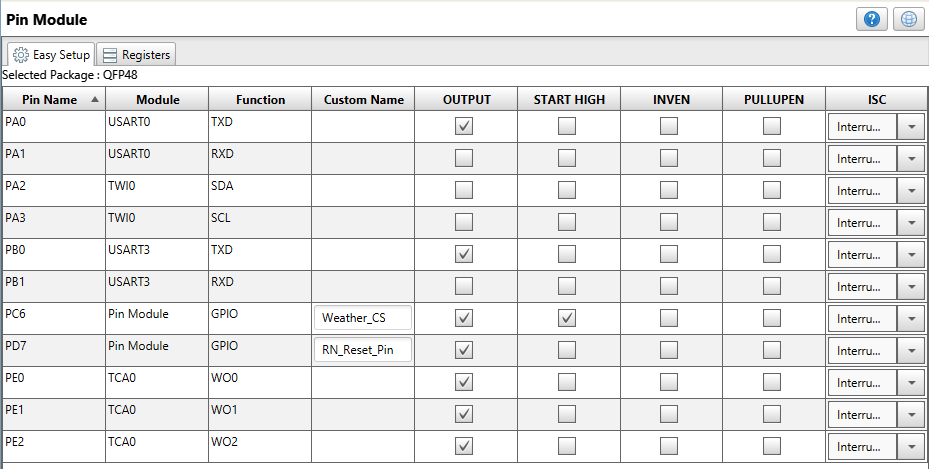

# Sending Weather Info to AWS Using BLE and ATmega4809

This project describes how to connect a MikroElektronika™ Weather Click™ sensor to the AWS cloud through a RN4870 BLE module from an ATmega4809 microcontroller.

In this example we will use a Curiosity Nano ATmega4809 board on a Curiosity Nano Adapter board with the RN4870 Click and Weather Click boards. A Raspberry Pi 3 Model B+ board will be used as the gateway for pushing the data to the AWS cloud.

The Lambda function that needs to be deployed on the gateway is also found here.

The app note that explains this application in detail can be found here is AN3406 - Fast Prototyping of BLE Sensors for AWS Cloud Using the ATmega4809 Curiosity Nano Development Platform.
A tutorial that provides the steps needed to setup this functionality can be found here: https://www.hackster.io/ble-weather-aws/connect-ble-weather-sensor-to-the-cloud-e79d9d

## Related Documentation
- [ATMEGA4809 Product Page](https://www.microchip.com/wwwproducts/en/ATMEGA4809)
- [AN3406 - Fast Prototyping of BLE Sensors for AWS Cloud Using the ATmega4809 Curiosity Nano Development Platform](https://www.microchip.com/wwwappnotes/appnotes.aspx?appnote=en1001647)

## Software Used
- MPLAB® X IDE 5.30 or newer [(microchip.com/mplab/mplab-x-ide)](http://www.microchip.com/mplab/mplab-x-ide)
- MPLAB® XC8 2.10 or newer compiler [(microchip.com/mplab/compilers)](http://www.microchip.com/mplab/compilers)
- MPLAB® Code Configurator (MCC) 3.95 or newer [(microchip.com/mplab/mplab-code-configurator)](https://www.microchip.com/mplab/mplab-code-configurator)
- ATmega DFP 2.0.12 or newer Device Pack

## Hardware Used
- ATmega4809 Curiosity Nano [DM320115](https://www.microchip.com/developmenttools/ProductDetails/DM320115)
- Curiosity Nano Base for Click boards™ [AC164162](https://www.microchip.com/developmenttools/ProductDetails/AC164162)
- Raspberry Pi 3 Model B+
- MikroElektronika™ Weather Click™ [MIKROE-1978](https://www.mikroe.com/weather-click)
- MikroElektronika™ RN4870 Click™ [MIKROE-2543](https://www.mikroe.com/rn4870-click)

## Setup

 

### MCC Settings

Here are the settings used for USART, TWI, TCA and the Weather Click.

### System Settings

 

### USART Settings
 
 

### TWI Settings
 

### TCA Settings
 

### Weather Click settings
 

### PIN Grid
 

### PIN Module
 
