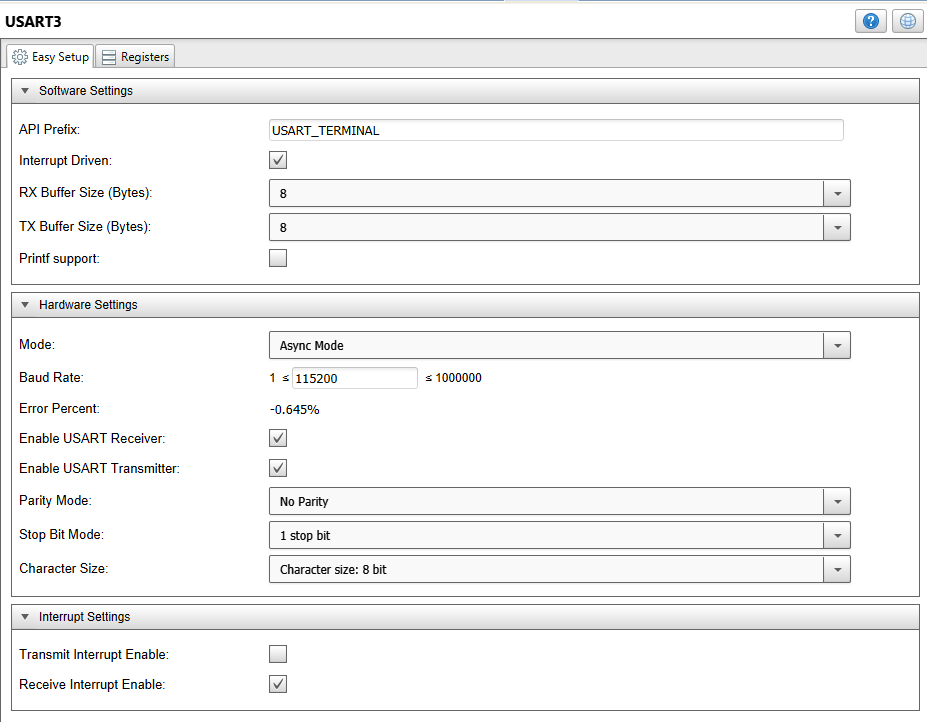
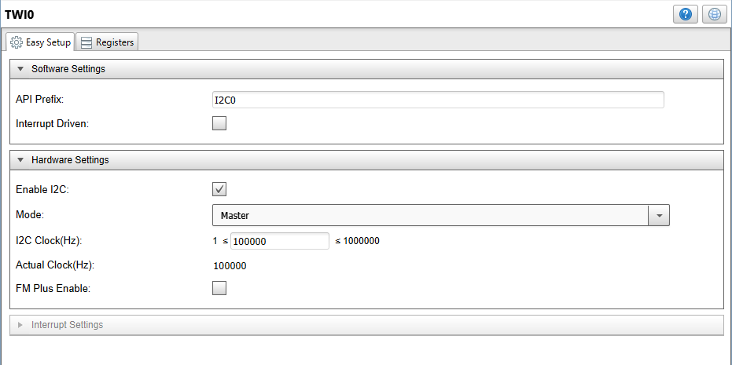
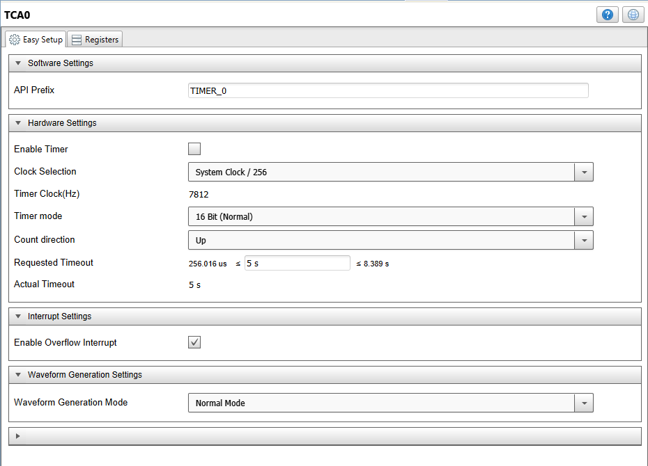

  <article class="markdown-body entry-content p-3 p-md-6" itemprop="text">

# Introduction
This project describes how to connect a Click Weather sensor to the AWS cloud through a BLE module from an ATmega4809 microcontroller.

# Description
In this example we will use a Curiosity Nano ATmega4809 board on a Curiosity Nano Adapter board with the RN4870 Click and Weather Click boards. A Raspberry Pi 3 Model B+ board will be used as the gateway for pushing the data to the AWS cloud.

The Lambda function that needs to be deployed on the gateway is also found here.

The app note that explains this application in detail can be found here: http://ww1.microchip.com/downloads/en/Appnotes/AN3406-Fast-Prototyping-of-BLE-Sensors-for-AWS-Cloud-DS00003406A.pdf

A tutorial that provides the steps needed to setup this functionality can be found here: https://www.hackster.io/ble-weather-aws/connect-ble-weather-sensor-to-the-cloud-e79d9d

## Required Software Tools
-MPLAB X 5.30 or newer IDE

-XC8 2.10 or newer compiler

-ATmega_DFP 2.0.12 or newer

# MCC Settings

Here are the settings used for USART, TWI, TCA and the Weather Click.

### System Settings

### USART Settings

### TWI Settings

### TCA Settings

### Weather Click settings

### PIN Grid

### PIN Module

